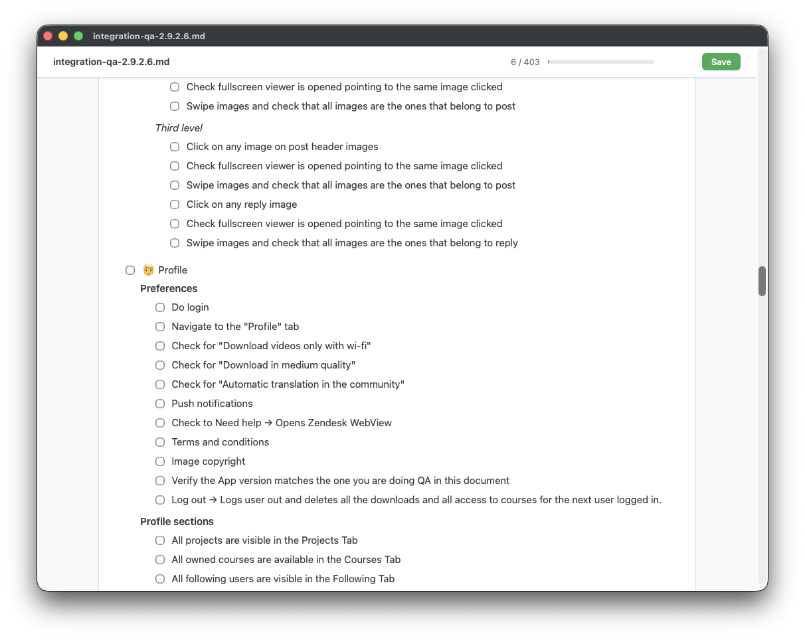

# MarkdownChecker

A lightweight macOS app that previews Markdown files in a native window with interactive checkboxes, read-progress tracking, and direct-to-disk saving.



## Features

- Renders `.md` files instantly using [marked.js](https://marked.js.org)
- Interactive checkboxes — check/uncheck tasks and save back to the original file
- Read-progress bar showing checked vs total items
- **Cmd+S** to save, or click the Save button
- Works as a default "Open With" app for `.md` files
- Native macOS window (AppKit + WKWebView) — no Electron, no dependencies

## Requirements

- macOS 13 or later
- Xcode Command Line Tools

If you don't have the CLI tools yet:

```bash
xcode-select --install
```

## Installation

Clone the repo and run the setup script:

```bash
git clone https://github.com/voghDev/MarkdownChecker.git
cd MarkdownChecker
bash setup.sh
```

`setup.sh` will:

1. Compile the Swift source
2. Build the app bundle at `/Applications/MarkdownPreview.app`
3. Generate the app icon
4. Register the app with macOS Launch Services

## Set as default Markdown opener (optional)

1. Right-click any `.md` file in Finder
2. **Get Info** → **Open With**
3. Select **MarkdownPreview**
4. Click **Change All…**

After this, double-clicking any `.md` file will open it in MarkdownPreview.

## Usage

**From Finder:** double-click any `.md` file (if set as default opener), or right-click → Open With → MarkdownPreview.

**From the terminal:**

```bash
/Applications/MarkdownPreview.app/Contents/MacOS/MarkdownPreview /path/to/file.md
```

### Saving changes

Checking or unchecking a task box auto-saves immediately. You can also save manually:

- Press **Cmd+S**
- Click the **Save** button in the toolbar

Changes are written directly back to the original `.md` file.

## Uninstall

```bash
rm -rf /Applications/MarkdownPreview.app
```

## License

MIT
